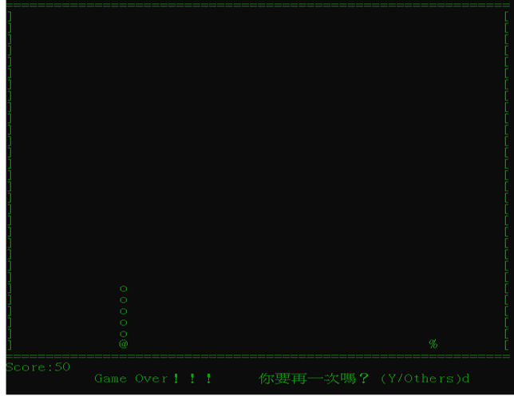

## 資工 1A
## 第九組
## 李馥彤(組長)、鄭心瑜
# Snake 
### 程式介紹  
我們製作的是貪吃蛇遊戲，相信各位小時候都玩過，  
幫大家回味童年，是個簡單又好玩的經典趣味小遊戲。
### 程式規則  
防止蛇頭去撞到牆壁或吃到自己的身體。
### 程式玩法    
利用方向鍵控制貪吃蛇移動方向，想辦法吃到果實，  
蛇身將會隨之長大愈來愈長，
一旦失控撞上牆壁或自己的身體，遊戲就會結束。
### 如何安裝執行  
下載完成後，可以使用 Visual Studio 開啟。    

 
### 分工資訊  
| 李馥彤 | 鄭心瑜 |  
|:---:|:---:|  
|Snake|Map|
|Food|介面|

